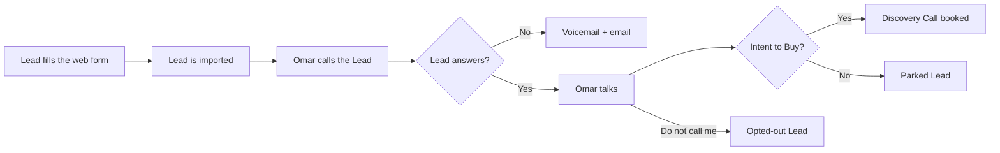
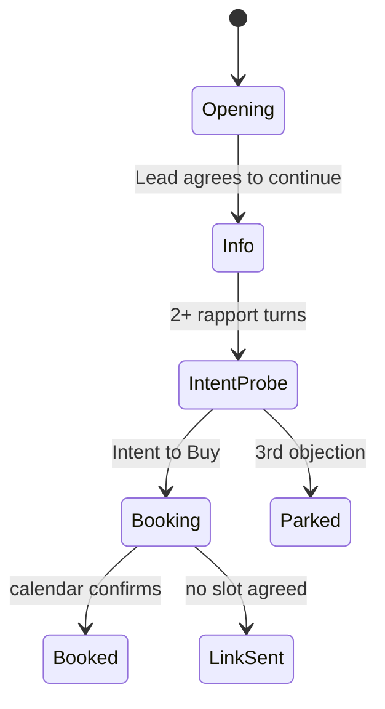
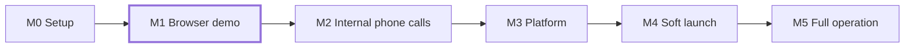

# Omar: an AI Calling Agent

Omar is an AI voice agent for **Hoplon & Co**, a web, mobile and digital-marketing agency in the UAE.
Omar phones warm **Leads** (people who filled in the website form).
He gives them the information they asked for, finds **Intent to Buy**, and books a **Discovery Call** on the Manager's Google Calendar.

> **Status:** planning is complete. Milestone **M1, the browser demo**, is built on branch `demo/web/v1`.
> It needs API keys for a live call; see "Run the demo".

## How a call works



## The main design rule

**Code owns the call. The LLM writes the words.**
A state machine in `core/` decides the call stage. The LLM only speaks inside the current stage and reports what the Lead did.
The code enforces these rules on every call:

- the fixed legal opening order;
- no budget or timeline talk;
- no "you are booked" before the calendar confirms;
- an honest answer when the Lead asks "are you an AI?".

See [ADR 0001](docs/adr/0001-code-owned-call-state-machine.md).



## Stack

| Job | Demo (M1) | Production (v1) |
|---|---|---|
| Voice loop | [LiveKit Agents](https://docs.livekit.io/agents/) (Python) | Same |
| Audio transport | LiveKit Cloud, WebRTC from the browser | LiveKit SIP + Twilio |
| Speech to text | Deepgram Flux | Deepgram Flux (EU) |
| LLM | Qwen3.8-27B on Groq | Qwen3.8-27B on our own GPU (Dublin) |
| Text to speech | Cartesia Sonic | Cartesia Sonic (EU) |
| Backend / dashboard | Not in the demo | FastAPI, Postgres, Redis, Celery / Next.js |

See [ADR 0002](docs/adr/0002-livekit-agents-over-hand-written-orchestration.md).

## Milestones



## Repo map

| Path | Contents |
|---|---|
| [`CONTEXT.md`](CONTEXT.md) | Glossary. Use these words in code and docs. |
| [`docs/adr/`](docs/adr/) | Architecture decisions |
| [`docs/*.pdf`](docs/) | Executive brief (2 pages) and engineer guide (14 pages) |
| [`docs/pdf-src/`](docs/pdf-src/) | HTML sources of the PDFs |
| [`.scratch/calling-agent/map.md`](.scratch/calling-agent/map.md) | Planning map: every decision in one place |
| [`.scratch/calling-agent/issues/`](.scratch/calling-agent/issues/) | Planning tickets 01–31 |
| [`.scratch/calling-agent/research/`](.scratch/calling-agent/research/) | Research notes |
| [`.scratch/calling-agent/prototypes/`](.scratch/calling-agent/prototypes/) | Clickable call-flow prototype. Open it in a browser. |
| [`.scratch/calling-agent/assets/`](.scratch/calling-agent/assets/) | Agency knowledge sheet and dummy Lead data |

Code layout:

```
core/    pure domain: call state machine, rules, prompts (no vendor imports)
voice/   LiveKit agent worker: Omar
web/     Next.js "Talk to Omar" page
evals/   text-mode conversation tests
```

## Run the demo (M1)

The full plan is in [`docs/demo-plan.md`](docs/demo-plan.md).

1. Copy `.env.example` to `.env`. Add the LiveKit, Deepgram, Groq and Cartesia keys.
2. Install: `uv sync`, `uv run python -m livekit.agents download-files`, `cd web && pnpm install`.
3. Start the worker: `uv run omar-agent dev`.
4. Start the page: `cd web && pnpm dev`. Open http://localhost:3000.

Without keys, open the page and click **Watch a sample call**. The page plays a call with synthetic data, and labels it as synthetic.

Tests: `uv run pytest` (offline, no keys) and `uv run pytest evals -m live` (real Groq, text mode).

## Start here

1. Read [`CONTEXT.md`](CONTEXT.md).
2. Read the two ADRs.
3. Open the [call-flow prototype](.scratch/calling-agent/prototypes/PROTOTYPE-call-flow.html) in a browser and click through a call.
4. Read [`map.md`](.scratch/calling-agent/map.md).

---

Research and design by Engr Abdullah Bukhari, Snr. SWE, Hoplon & Co.
