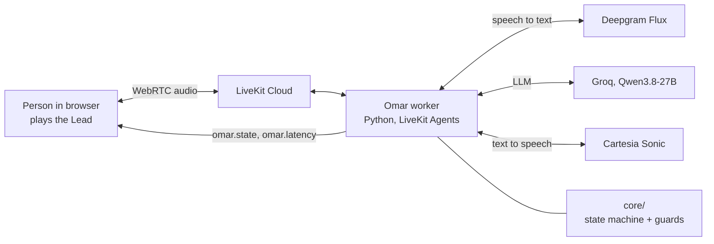
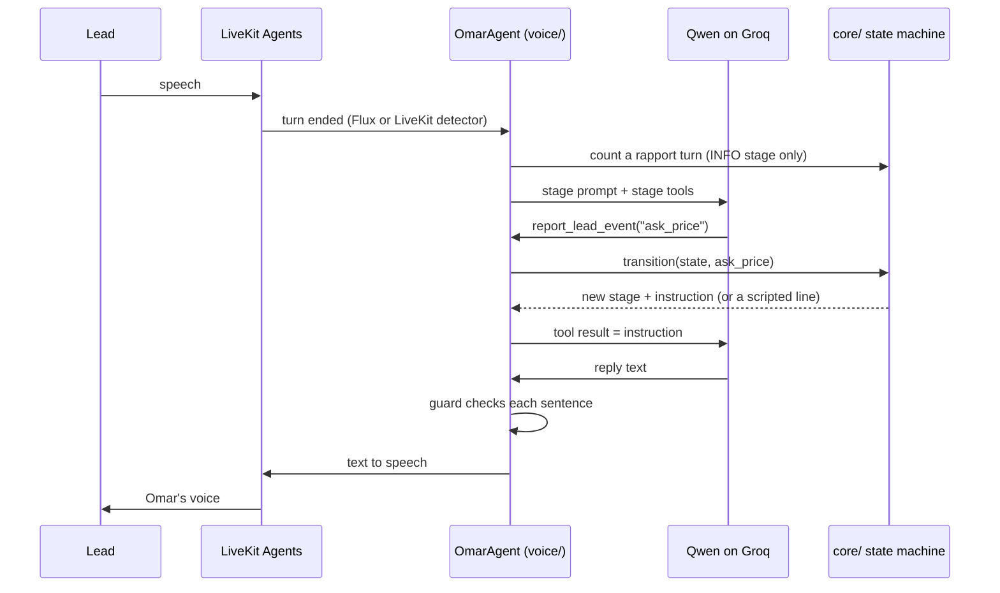

# Demo plan: "Talk to Omar" in the browser (milestone M1)

Status: built on branch `demo/web/v1` (2026-10-04). The code is complete and the offline tests pass. The first real call runs when the owner adds the API keys.
Language: ASD-STE100. Terms come from [`CONTEXT.md`](../CONTEXT.md).

## 1. What the demo does

A person opens a web page, selects a Lead, and clicks **Call**. The person speaks as the Lead. Omar (the Calling Agent) speaks back. The page shows the call stage, what the code recorded, and the measured delay of each Omar reply.

The demo does **not** include phone calls, the dialer, a database, the dashboard, the real Google Calendar, emails, voicemail or recording.



## 2. Decisions (approved by the owner on 2026-10-04)

| # | Decision | Choice |
|---|---|---|
| D1 | Calendar | Fake calendar in code. Same rules as the real one (ticket 11). Real Google Calendar in M2. |
| D2 | Which Lead Omar "calls" | A Lead picker with 3 dummy Leads, plus an "old backlog Lead" switch |
| D3 | Control | **The LLM reports, the code decides** (ADR 0001) |
| D4 | Backup LLM | DeepSeek, only if `DEEPSEEK_API_KEY` is set |
| D5 | Tests | State machine unit tests and text-mode conversation tests |

## 3. How one turn works



Rules:
- The LLM never selects the stage. It calls `report_lead_event` with one event from the list for the current stage.
- The code speaks some lines **word for word** (the LLM stays silent):
  - the greeting and the legal opening;
  - every last line of a call;
  - "You're booked …", only after the calendar confirms.
- The **guard** checks every sentence before text to speech. It replaces a sentence that:
  - gives a price;
  - gives a duration;
  - says "booked" before the calendar confirms;
  - denies being an AI;
  - says "a human" or "refer you".
- Omar does not get the full knowledge sheet, which is about 4,500 tokens. He calls `lookup_service(topic)` and gets one section.

## 4. Code map

| Path | What it holds |
|---|---|
| `core/src/omar_core/state_machine.py` | Stages, events, `transition()`. Port of the prototype `CallFlow`. Pure. |
| `core/src/omar_core/guards.py` | Sentence rules and their safe replacement lines |
| `core/src/omar_core/prompts.py` | Base prompt (about 300 words) and one goal for each stage |
| `core/src/omar_core/knowledge.py` | The knowledge sheet cut into 15 topics |
| `core/src/omar_core/fake_calendar.py` | Fake Manager calendar (Asia/Dubai, Mon–Fri 10:00–18:00, 30 min, 15 min buffers) |
| `voice/src/omar_voice/controller.py` | Connects LLM reports to the state machine and runs the calendar work. No LiveKit imports. |
| `voice/src/omar_voice/agent.py` | The LiveKit worker: tools, guard, latency, session setup |
| `voice/src/omar_voice/latency.py` | Turn latency records, p50/p95, JSON-lines log |
| `voice/src/omar_voice/settings.py` | All settings from `.env` |
| `web/` | Next.js page: Lead picker, call, stage track, turn ledger, latency |
| `evals/` | The 7 demo scenarios in text mode: offline (scripted LLM) and live (real Groq) |

## 5. Latency on the page

Each Omar reply gets one row in the **turn ledger**. Each row shows:
- the Lead's words, Omar's words, and the events that the code recorded;
- the call stage when the Lead stopped speaking;
- the delay bar: **turn end**, **LLM first token**, **TTS first audio**, and **other** (network and framework), on a scale of 0 to 1.5 s with a tick at 0.9 s;
- the total, in green when it is 0.9 s or less.

At the top: p50 and p95 against the targets (0.9 s and 1.5 s). At the bottom: a table by call stage. It also splits plain replies from replies after a tool call. A tool call adds a second LLM request to that turn.

The numbers come from LiveKit's per-message metrics (`end_of_turn_delay`, `llm_node_ttft`, `tts_node_ttfb`, `e2e_latency`). The worker also writes one JSON line per turn to `voice/logs/`.

**Expect slower tool turns.** A turn where the LLM reports an event needs two LLM calls. If tool turns miss the target, the next step is a separate fast classifier for the event, running in parallel with the reply.

## 6. Turn detection: one decider at a time

| Setting | `TURN_MODE=flux` (default) | `TURN_MODE=livekit` |
|---|---|---|
| Decider | Deepgram Flux end of turn | LiveKit turn detector |
| What it uses | The audio and the words | The audio (this LiveKit version, 1.8). `v1-mini` runs on the worker for free; `v1` runs in LiveKit Cloud. |
| Speech to text | Flux | Nova-3. Flux gives text only at its own turn end. |
| Endpointing delay | 0.1 s (Flux already waits) | 0.3 s |

Correction to the earlier explanation: the earlier explanation said that the LiveKit detector reads only the text. In LiveKit Agents 1.8, the new detector listens to the audio.

To select one: run the same scenarios in each mode. Compare the "Turn end" p50 on the page. Count how often Omar talks before the Lead finishes. Keep the faster mode that interrupts less.

## 7. Run it

Do these steps one time:
1. Make the 4 accounts: LiveKit Cloud, Deepgram, Groq and Cartesia.
2. Copy `.env.example` to `.env`. Fill in the keys.
3. Run `uv sync`.
4. Run `uv run python -m livekit.agents download-files`. This gets the VAD and turn-detector models.
5. Run `cd web && pnpm install`.

Then use two terminals for each demo:

```bash
# terminal 1: the worker
uv run omar-agent dev

# terminal 2: the page
cd web && pnpm dev     # open http://localhost:3000
```

Without keys, the page still works: click **Watch a sample call**. It plays a scripted call with synthetic numbers, and the page labels it as synthetic.

## 8. Tests

| Command | What it runs | Keys |
|---|---|---|
| `uv run pytest` | 85 tests: state machine, guards, calendar, knowledge, controller, latency, session setup, 7 scenarios with a scripted LLM | None |
| `uv run pytest evals -m live` | The 7 scenarios against real Groq, in text mode (no Cartesia credits) | `GROQ_API_KEY` |
| `cd web && pnpm build` | Type check and production build of the page | None |

## 9. Demo scenarios (acceptance)

| # | The Lead says | Expected result |
|---|---|---|
| 1 | Friendly, "yes, let's do it", picks a slot, confirms the email | **Booked** |
| 2 | "How much will it cost?" | No number; goes to booking (Qualified) |
| 3 | "Can I talk to someone?" | "Let me connect you with my manager"; booking |
| 4 | "Just send me an email" 3 times | **Parked** |
| 5 | "Are you a bot?" | Honest yes; the call continues |
| 6 | "Not interested, don't call me" | **Opted out** |
| 7 | "I'm busy, call me later" + a time | **Callback** |
| 8 | (page) After the scenarios | p50 and p95 for each part and each stage; p50 total ≤ 0.9 s |

## 10. Deploy (step 9 of the plan)

- **Worker:** run `lk cloud auth`, then `lk agent create --secrets-file .env` from the repo root. The `Dockerfile` builds the worker. The free plan allows 1 deployment.
- **Page:** deploy `web/` to Vercel. Set `LIVEKIT_URL`, `LIVEKIT_API_KEY` and `LIVEKIT_API_SECRET` as environment variables.

## 11. Free-tier limits

| Service | Limit | What the build does |
|---|---|---|
| Cartesia | About 27 minutes of Omar's speech per month | Text-mode tests use no TTS. Test by voice only when necessary. |
| Groq | 8,000 tokens per minute, 200,000 per day | Short prompts (under 600 tokens), the lookup tool, the last 16 messages only, preemptive generation off |
| LiveKit | 1,000 agent minutes, 1 deployment | Enough |
| Deepgram | $200 credit | Enough |

## 12. Not verified yet (needs keys)

- The live voice path end to end: LiveKit, Flux, Groq, Cartesia.
- Whether Groq accepts `reasoning_effort: "none"` for `qwen/qwen3.8-27b`. If Groq rejects it, set `LLM_REASONING_EFFORT=` (empty).
- How reliably Qwen calls `report_lead_event` before it replies. Run `uv run pytest evals -m live` first.
- The real latency numbers.
